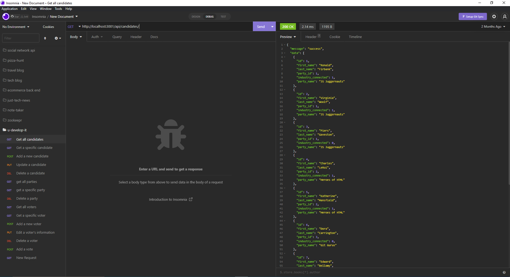

# u-develop-it

- Github URL: https://github.com/DanielCConlon/u-develop-it

## Table-of-Contents

- [Description](#description)
- [Usage](#usage)
- [Application](#application)

## [Description](#description)

U-develop-it is a voting application created following the steps of a course module on Express.js and MySQL.

## [Usage](#table-of-contents)

You will have to setup the routes in insomnia to use this application.

## [Application](#table-of-contents)

